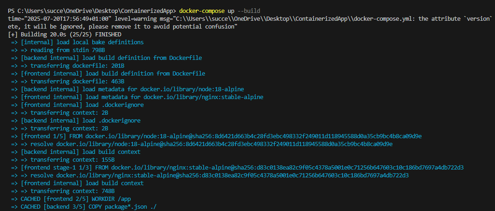
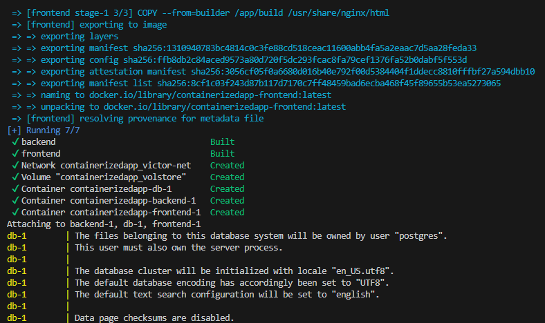
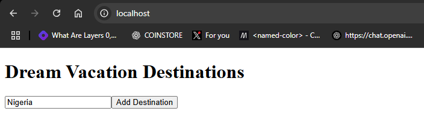

# Dream Vacations App

A full-stack, containerized web application for exploring and managing travel destinations.

## Tech Stack

- **Frontend**: React
- **Backend**: Node.js (Express)
- **Database**: PostgreSQL
- **Containerization**: Docker & Docker Compose
- **CI/CD**: GitHub Actions

## Architecture

Below is the project architecture diagram:

<p align="center">
  
</p>

## Features

- Browse and explore dream vacation destinations
- Persistent storage with PostgreSQL
- Fully containerized with Docker
- Automated CI/CD pipeline for building and pushing Docker images

## Getting Started

### Prerequisites

- [Docker](https://www.docker.com/get-started) installed
- [Docker Compose](https://docs.docker.com/compose/install/) installed
- [Git](https://git-scm.com/downloads) installed

### Installation

1. **Clone the repository**
   ```bash
   git clone https://github.com/Vivixell/ContainerizedApp.git
   cd ContainerizedApp
   ```
2. **Start the app**
   ```
   docker-compose up --build
   ```
   This command builds the Docker images and starts the containers.

   

   **Successful build output:**

   

3. **Access the app**
   Open your browser and navigate to **`http://localhost`** to view the app.

   

4. **Notes:**
   - Ensure Docker is running before executing `docker-compose up`

   - Stop containers with `docker-compose down` or use `docker-compose down -v --remove-orphans` to remove persistent volumes.

---
### CI/CD Workflow

This project uses GitHub Actions to automate the build, test, and deployment process.

**Trigger:** 
- Runs automatically on any push to the dev branch.

- Can also be started manually from the GitHub Actions tab.

**Pipeline Steps Performed:**

1. Check out the repository code.

2. Install dependencies for the frontend or backend.

3. Run optional lint and test scripts (skipped if not defined).

4. Build Docker images for the frontend and backend.

5. Tag images with the current commit SHA for versioning.

6. Push the images to Docker Hub.

**Secrets Required** (set in **GitHub → Settings → Secrets and variables → Actions**):

- **`DOCKER_USERNAME`** → Your Docker Hub username.

- **`DOCKER_TOKEN`** → A Docker Hub access token.

**Workflow Files**
- **`.github/workflows/frontend.yml`** → Handles building and pushing the frontend image.

- **`.github/workflows/backend.yml`** → Handles building and pushing the backend image.