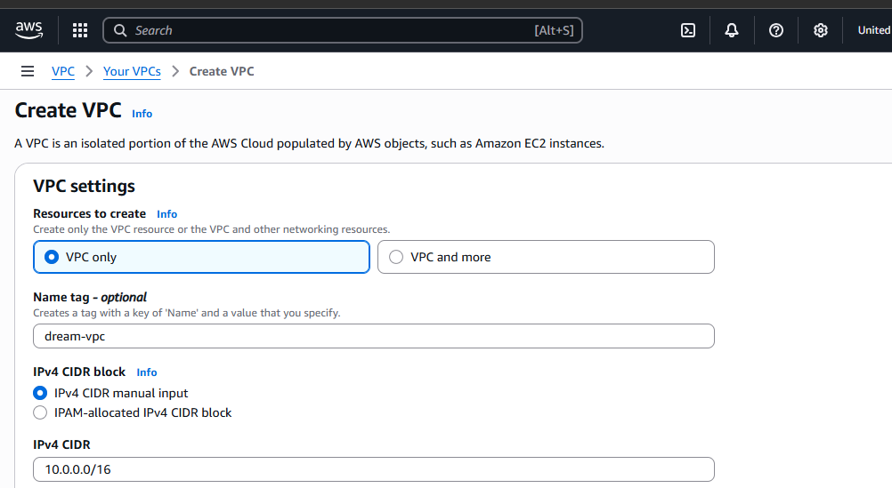
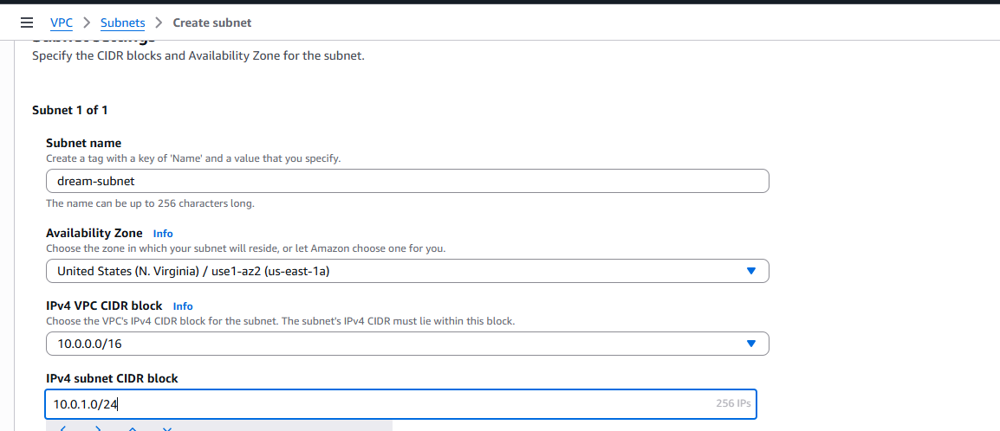
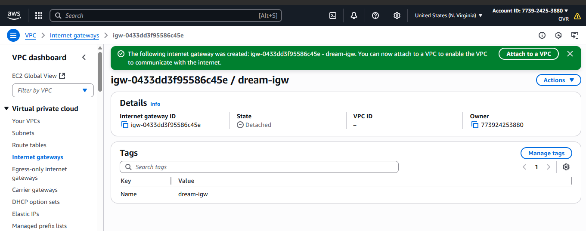
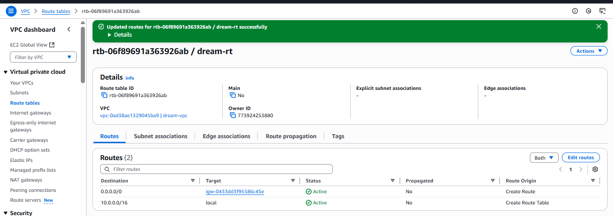
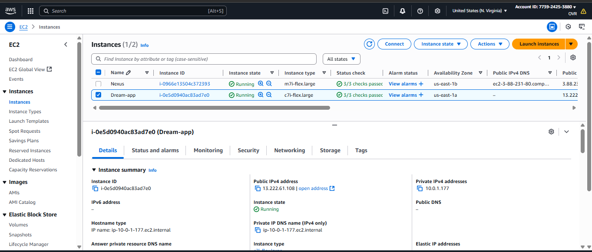
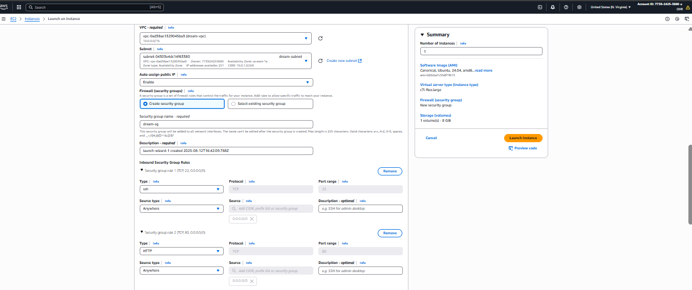
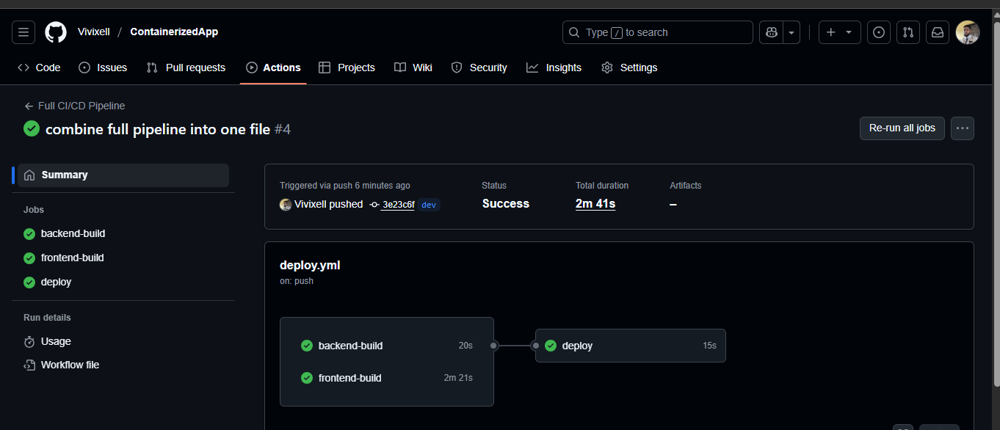
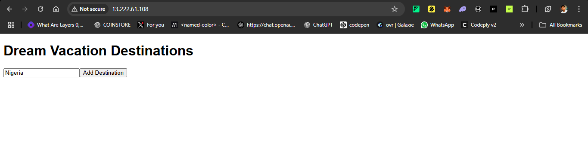

# Dream Vacations App

A full-stack, containerized web application for exploring and managing travel destinations, deployed on AWS EC2 with a fully automated CI/CD pipeline.

## Tech Stack

- **Frontend**: React
- **Backend**: Node.js (Express)
- **Database**: PostgreSQL
- **Containerization**: Docker & Docker Compose
- **CI/CD**: GitHub Actions
- **Cloud**: AWS (VPC, EC2)

## Architecture

Below is the project architecture diagram:

<p align="center">
  
</p>

## Features

- Browse and explore dream vacation destinations
- Persistent storage with PostgreSQL
- Fully containerized with Docker
- Automated CI/CD pipeline for building, pushing, and deploying Docker images to an AWS EC2 instance

## AWS Infrastructure Setup

The application is deployed on an AWS EC2 instance within a custom VPC, configured as follows:

1. **VPC Setup**:
   - **Name**: dream-vpc
   - **IPv4 CIDR**: 10.0.0.0/16
   - **Screenshot**:

<p align="center"></p>

2. **Subnet Setup**:
   - **Name**: dream-subnet
   - **IPv4 CIDR**: 10.0.1.0/24
   - **Screenshot**:
   
   <p align="center"></p>

3. **Internet Gateway**:
   - **Name**: dream-igw
   - **Attached to**: dream-vpc
   - **Screenshot**: 
   
<p align="center"></p>

4. **Route Table**:
   - **Name**: dream-rt
   - **Associated with**: dream-vpc and dream-subnet
   - **Routes**: Includes route to `0.0.0.0/0` via dream-igw for internet access
   - **Screenshot**: 
   
   <p align="center"></p>

5. **EC2 Instance**:
   - **AMI**: Ubuntu
   - **Instance Type**: t2.micro
   - **Security Group**: Allows inbound traffic on ports 80 (HTTP), 3001 (backend), and 22 (SSH)
   - **Screenshot**: 
   
   <p align="center"></p>

   - **Security Group Screenshot**:

<p align="center"></p>

## Getting Started

### Prerequisites

- [Docker](https://www.docker.com/get-started) installed
- [Docker Compose](https://docs.docker.com/compose/install/) installed
- [Git](https://git-scm.com/downloads) installed
- AWS account with EC2 instance running (see AWS setup above)

### Local Installation (Optional)

1. **Clone the repository**
   ```bash
   git clone https://github.com/Vivixell/ContainerizedApp.git
   cd ContainerizedApp

2. **Start the app locally**
   ```
   docker-compose up --build
   ```
   **This builds the Docker images and starts the containers.**

   


   **Successful build output:**

   
   
   
   
3. **Access the app locally**

   **Open your browser and navigate to `http://localhost` to view the app.**


   


   **Notes:**

   - Ensure Docker is running before executing docker-compose up.
   - Stop containers with **`docker-compose down`** or use **`docker-compose down -v --remove-orphans`** to remove persistent volumes.

---

## Deployment

The app is deployed to an AWS EC2 instance via a GitHub Actions pipeline:

**CI/CD Pipeline:** Builds, tests, and pushes Docker images to Docker Hub, then deploys to EC2 by copying the repository, pulling images, and running docker-compose up.

**Trigger:** Runs on push to the dev branch or manually via GitHub Actions.

Pipeline Logs Screenshot: 



App Running on EC2: 



**Secrets Required** (set in `GitHub → Settings → Secrets and variables → Actions`):

**DOCKER_USERNAME:** Your Docker Hub username.

**DOCKER_TOKEN:** Your Docker Hub access token.

**EC2_HOST:** Public IP of your EC2 instance.

**EC2_USER:** SSH user for EC2 (e.g., ubuntu).

**EC2_KEY:** SSH private key for EC2 access.

**Workflow File:**

- **.github/workflows/ci-cd.yml:** Handles building, pushing, and deploying both frontend and backend.


**Access the Deployed App:**

- Open your browser and navigate to `http://<EC2_PUBLIC_IP>` to view the app.

### CI/CD Workflow


The pipeline automates the following:

**Backend Build:**

- Checks out code, installs Node.js, runs lint/tests, builds, and pushes the backend Docker image to Docker Hub.


**Frontend Build:**

- Checks out code, installs Node.js, runs lint/tests, builds, and pushes the frontend Docker image to Docker Hub.


**Deployment:**

- Copies the repository to the EC2 instance via SCP.

- SSHs into EC2, installs Docker/Compose if needed, sets environment variables, pulls the latest images, and runs docker-compose up.


The pipeline ensures builds complete before deployment and is idempotent (multiple runs won’t cause errors).
